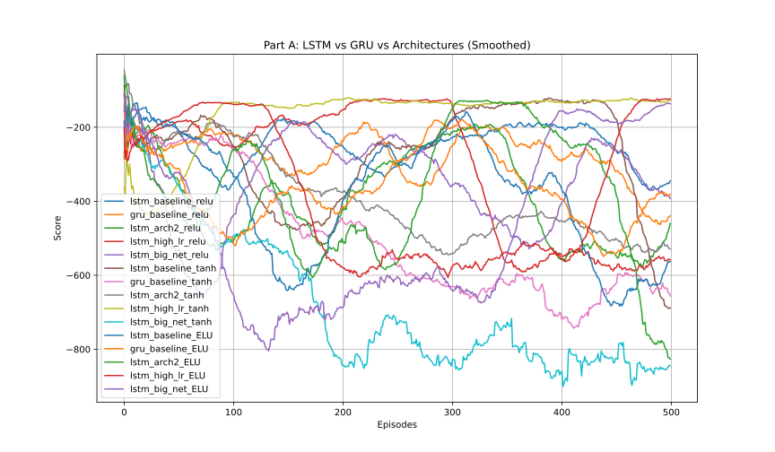
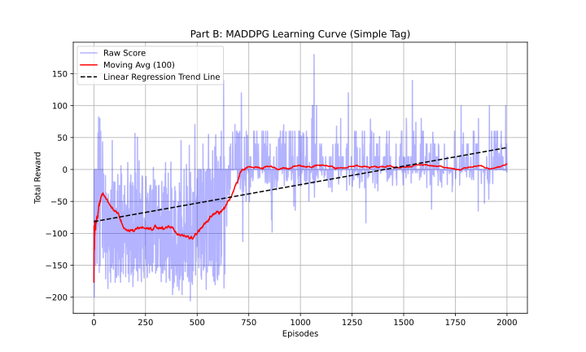

Reinforcement Learning Project
==============

University of Athens  
Department of Informatics and Telecommunications

| Name                | Student Registration Number |
|---------------------|-----------------------------|
| Ioannis Petrakis    | 1115201900155               |
| Georgios Vaindirlis | 7115122400001               |

# Single Agent POMDPs

## 1. Environment and Partial Observability

We use the **LunarLander-v3** environment from Gymnasium, a discrete-control task in which an agent must safely land a lunar module between two flags. At each timestep, the agent selects one of four actions corresponding to firing different engines or taking no action.

### Original Observation Space

In the standard (fully observable) environment, the agent receives an 8-dimensional continuous observation vector:

- Horizontal position (`x_pos`)
- Vertical position (`y_pos`)
- Horizontal velocity (`x_vel`)
- Vertical velocity (`y_vel`)
- Lander orientation (`angle`)
- Angular velocity (`ang_vel`)
- Left leg ground contact (`left_leg`)
- Right leg ground contact (`right_leg`)

Because both position and velocity information are provided, the full system state is observable and the environment satisfies the Markov property.

### Partially Observable Modification

To introduce partial observability, we apply a wrapper that **removes all velocity-related components** from the observation vector, specifically:

- horizontal velocity,
- vertical velocity, and
- angular velocity.

The resulting observation is a 5-dimensional vector consisting of:

- horizontal position,
- vertical position,
- orientation angle,
- left leg contact indicator, and
- right leg contact indicator.

### Why the Environment Is Partially Observable

After masking velocity information, the agent can no longer uniquely infer the true physical state of the lander from a single observation. Multiple underlying states with different velocities can produce identical observations, yet require different optimal actions. This violates the Markov property, as the current observation alone is insufficient to predict future dynamics.

As a result, the environment becomes a **Partially Observable Markov Decision Process (POMDP)**. To act optimally, the agent must integrate information over time and infer latent variables such as velocity from the history of observations, motivating the use of recurrent neural network policies.

## 2. Recurrent Actor–Critic with LSTM and GRU

We implemented a **recurrent Actor–Critic (AC)** agent to solve the partially observable LunarLander environment. A single recurrent neural network (RNN) processes the observation sequence to extract time-dependent features, which are then passed to separate feed-forward heads for the actor (policy) and critic (value estimation).

Two recurrent architectures were evaluated:

- **LSTM-based Actor–Critic**
- **GRU-based Actor–Critic**

Both models used the same hidden size, learning rate, optimizer, and training budget to ensure a fair comparison.

### Performance Comparison

From the experimental results:

- The **LSTM baseline** gradually improved during training.
- The **GRU baseline** showed early instability and progressively deteriorated.

The LSTM consistently outperformed the GRU in this task. This is expected because:

- The environment is **partially observable**, with velocity information removed.
- Successful control requires integrating information over long time horizons to infer latent velocities.
- LSTMs include an explicit memory cell and gating mechanisms that better preserve long-term information.
- GRUs, while simpler and faster, have reduced memory capacity and were less stable under long episodes and noisy rewards.

As a result, the LSTM was better suited to maintaining a belief state over the hidden dynamics of the system.

## 3. Effect of Hyperparameters

We examined the impact of several hyperparameters on performance.

### Learning Rate

- **Baseline (0.002)**: Stable learning and gradual improvement.
- **High learning rate (0.01)**: Most stable and highest final performance when paired with the **tanh** activation function. With **ReLU** and **ELU** training became unstable and consistently diverged.

Recurrent Actor–Critic models are highly sensitive to the learning rate. Large updates destabilize both the policy and the recurrent hidden state.

### Network Size (Hidden Dimension)

- **64 units (baseline)**: Most stable and consistent learning.
- **128 units (larger network)**: Initially competitive, but training became unstable and performance collapsed late in training.

Larger recurrent networks increase representational capacity but also amplify optimization difficulty and overfitting in on-policy learning.

### Activation Functions

We evaluated three activation functions—**ReLU**, **tanh**, and **ELU**—to study their effect on recurrent Actor–Critic performance in the partially observable LunarLander environment.

- **ReLU**:
  - Provided stable and moderately fast learning.
  - LSTM baseline with ReLU reached a good average score, while the feature-extractor-first LSTM (`lstm_arch2_relu`) achieved better performance by the end of training.
  - Overall, ReLU maintained gradient flow effectively without saturating.

- **tanh**:  
Overall, tanh activations were sensitive to network size and learning rate. However, one configuration stood out:
   - **`lstm_high_lr_tanh`** demonstrated **consistently strong and stable performance** after early training, converging to good average scores and staying there through 500 episodes.
   - Other tanh-based configurations, particularly larger networks, still suffered from instability and performance collapse

- **ELU**:
  - Showed highly variable results.
  - Some configurations performed well temporarily, but most experienced large fluctuations or late-stage collapses.
  - ELU’s negative saturation likely introduced instabilities in recurrent learning over long episodes.

## 4. Alternative Architecture: Feed-Forward Feature Extraction Before RNN

We implemented an alternative architecture where:

1. A feed-forward network first extracts features from the raw observation.
2. These features are then passed to an RNN (LSTM).
3. The RNN output is processed by feed-forward actor and critic heads.

### Performance Comparison

The **feature-extractor-first LSTM** (`lstm_arch2`) achieved the best overall performance, which outperformed the simple LSTM architecture. It performed better because:

- The feed-forward layers learn useful spatial representations before temporal processing.
- The RNN operates on a more compact and informative feature space.
- This reduces the burden on the recurrent unit to model both spatial and temporal structure simultaneously.

---

## Executive Summary

- **LSTM > GRU** for this POMDP due to superior long-term memory handling.
- Moderate learning rates and network sizes are critical for stability.
- Adding a feed-forward feature extractor before the RNN improves performance.
- The best-performing model was the **LSTM with pre-RNN feature extraction**, demonstrating the importance of architectural design in recurrent reinforcement learning.

# Multi-Agent DRL

## 1. Overview

This report describes the implementation and training of a **Multi-Agent Deep Deterministic Policy Gradient (MADDPG)** algorithm applied to the **Simple Tag** multi-agent environment from the PettingZoo library. The system trains multiple agents that learn decentralized policies while leveraging centralized critics during training.

The implementation follows the standard MADDPG paradigm:

- **Decentralized execution:** Each agent selects actions using its own actor network.
- **Centralized training:** Each agent’s critic observes the joint state and joint action of all agents.

## 2. Environment Setup

- **Environment:** `simple_tag_v3.parallel_env`
- **Agents:** Multiple agents with individual observation spaces
- **Action Space:** Discrete (converted from softmax outputs via argmax)
- **Max Cycles per Episode:** 25

The Simple Tag environment is adversarial and cooperative, making it suitable for evaluating multi-agent reinforcement learning algorithms.

## 3. Replay Buffer

### `MultiAgentReplayBuffer`

A centralized replay buffer stores experiences for all agents:

- **State Memory:** Individual observations per agent
- **Action Memory:** Action probability vectors per agent
- **Reward Memory:** Per-agent rewards
- **Terminal Memory:** Episode termination flags per agent

**Key Features:**

- Supports off-policy learning
- Random mini-batch sampling

## 4. Neural Network Architectures

### 4.1 Actor Network

Each agent has its own actor network:

- **Input:** Agent’s local observation
- **Architecture:**  
  - Fully connected layer (ReLU)  
  - Fully connected layer (ReLU)  
  - Output layer with softmax activation
- **Output:** Probability distribution over discrete actions

This design enables stochastic policy learning while maintaining differentiability.

### 4.2 Critic Network

Each agent maintains a centralized critic:

- **Input:**  
  - Concatenated observations of all agents  
  - Concatenated actions of all agents
- **Architecture:**  
  - Fully connected layer (ReLU)  
  - Fully connected layer (ReLU)  
  - Linear output layer producing a scalar Q-value

The critic evaluates joint actions under the full system state.

## 5. Agent Design

Each agent contains:

- Actor and target actor networks
- Critic and target critic networks
- Soft target updates using Polyak averaging ($\tau$)

### Action Selection
- Actors output a probability distribution
- Actions are selected via `argmax` during environment interaction

### Target Network Updates
Target networks are updated smoothly:
$\theta' \leftarrow \tau \theta + (1 - \tau)\theta'$

## 6. MADDPG Learning Algorithm

### Centralized Learning Procedure

For each agent:

1. Sample a batch from the replay buffer
2. Compute target Q-values using target actors and critics
3. Update the critic using Mean Squared Error (MSE) loss
4. Update the actor by maximizing the expected Q-value
5. Apply gradient clipping for stability
6. Soft-update target networks

Learning occurs every **100 environment steps**, provided enough samples are available.

## 7. Training Loop

### Training Configuration

- **Episodes:** 2000
- **Batch Size:** 1024
- **Discount Factor ($\gamma$):** 0.99
- **Actor/Critic Learning Rate:** 0.01
- **Hidden Layers:** 64 units each

### Episode Flow

1. Reset environment
2. Collect observations for all agents
3. Select actions via MADDPG actors
4. Step environment
5. Store transitions in replay buffer
6. Periodically update networks
7. Track total episode reward

